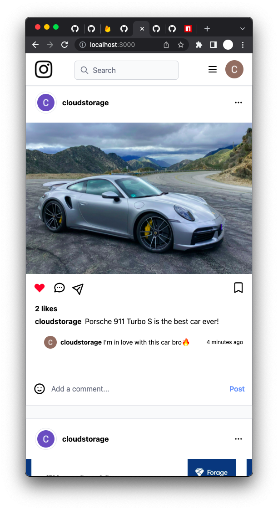

# igclone
This is an instagram clone built while learning NextJS

- Has authentication
- Uses Firebase
- Uses TailwindCSS
- Is responsive
- Has Post, Like and Comment functionalities

You can see the hosted version <a href="https://igclone-614.vercel.app/">here</a>

## Screenshots
Don't mind the 'cloudstorage' usernames. Those are just my Google accounts I use for storage only. 
PS: Usernames are automatically generated, but they're not unique.

<table>
    <tr>
        <td>
            
        </td>
        <td>
            
        </td>
    </tr>
</table>